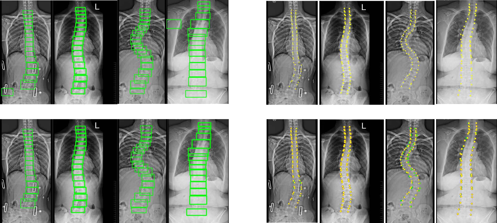

# Spine Curvature Estimation and Cobb Angle Estimation 

## About
This is a repository that includes all the codes used to build, train and test our framework. We participated in **Accurate Automated Spinal Curvature Estimation
MICCAI 2019 Challenge**. Our method achieved SMAPE score of 25.69 on test dataset. Details about the challenge is available at [AASCE 2019 Grand Challenge](https://aasce19.grand-challenge.org/Home/).
We presented our paper at MICCAI 2019 Workshop -- SpinEva2019. [Workshop](https://csi2019.wordpress.com/)

## Our Approach

Here, we propose a novel framework to estimate vertebra landmarks. This framework has two separately trained networks.

- Object Detector to Predict each vertebra as a single object.
- Landmark Estimator to find landmark location in each vertebra.

The overall network estimates 68 vertebrae landmarks (4 corners for each vertebra) to form a spinal curve. The vertebra detection and estimation is improved 
by applying some post processing that include outliers rejection and curve smoothing.Finally, we also compute 3 Cobb Angles (MT, PT, TL/L) using the slope of the vertebra landmarks.

## Result

## Usage
If you want to use this code, refer to this folder structure:
- Object_Detection : Faster-RCNN implementation. Please visit [Luminoth](https://github.com/tryolabs/luminoth) for more details on training and testing. We used their implementation.
- Landmark_Detection : Use codes here to train local landmark detector. It implements DenseNet in keras.
- CobbAngle_Calculation : It consisits of MATLAB code to smoothen estimated landmarks, and to calculate Cobb Angle from them.
- `TestAll.py`: Use this for inference. It combines Object Detection, Landmark Detection and outlier rejection in a pipeline to produce overall landmarks.
- Jupyter_Notebooks: Utility scripts written in notebook

*We are working on further improvement of this framework.*